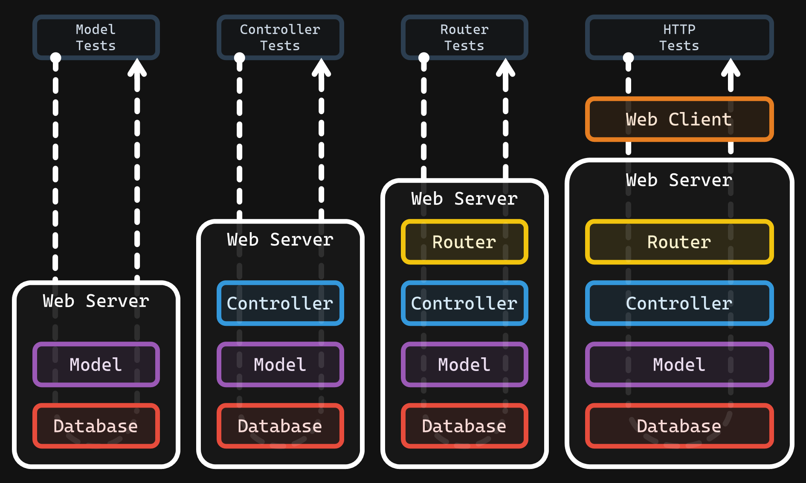

# Assignment 2 - Routing & Controllers 🚥

- 💯 **Worth**: 8%
- 📅 **Due**: March 7, 2021 @ 23:59
- 🙅🏽‍ **Penalty**: Late submissions lose 10% per day to a maximum of 3 days. Nothing is accepted after 3 days and a grade of 0% will be given.

## 🎯 Objectives

- **Transact** data to and from a database using models.
- **Interface** between the client and models using controllers.
- **Route** to the proper controller based on the HTTP method and resource requested.

## 🔨 Setup

1. Navigate to `~/web-ii/Assignments`.
2. Click `Code -> 📋` to copy the URL to the repository.
3. Clone the Git repo `git clone <paste URL from GitHub>` (without the angle brackets).
   - You may have to use the `HTTPS` or `SSH` URL to clone depending on your settings. If one doesn't work, try the other by clicking `Use SSH` or `Use HTTPS` above the 📋, and copy the new URL.
4. You should now have a folder inside `Assignments` called `assignment-2-githubusername`.
   - If you want, you can rename this folder to `2-Routing-Controllers` for consistency's sake! 😉
5. Inside of the newly cloned repo, copy all your models from A1 into `src/models`.

## 🔍 Context

> **🚨 Warning:** If you have not finished **E2.1, E2.2, and E2.3**, **turn back now and finish them** before attempting this assignment or you will be **terribly lost**. The exercises are designed to give you all the tools, knowledge, and strategies needed to complete the assignments.

In A1, we created the 4 main models (`User`, `Category`, `Post`, and `Comment`) that are in charge of talking to the database for our Reddit clone. The models are based on the entities from the ERD which can be found in the A1 specs. In this assignment, we will implement the following:

1. The `Router` which handles the web requests/responses and instantiates a `Controller`.
2. The `Controller` which decides what `Model` method to call.

## 🗺️ Routes

| HTTP Method | Path             | Controller | Action    |
| ----------- | ---------------- | ---------- | --------- |
| `GET`       | `/`              | Home       | `home`    |
| `ANY`       | `/{garbage}`     | Error      | `error`   |
| `POST`      | `/user`          | User       | `new`     |
| `GET`       | `/user`          | User       | `list`    |
| `GET`       | `/user/{id}`     | User       | `show`    |
| `PUT`       | `/user/{id}`     | User       | `edit`    |
| `DELETE`    | `/user/{id}`     | User       | `destroy` |
| `POST`      | `/category`      | Category   | `new`     |
| `GET`       | `/category`      | Category   | `list`    |
| `GET`       | `/category/{id}` | Category   | `show`    |
| `PUT`       | `/category/{id}` | Category   | `edit`    |
| `DELETE`    | `/category/{id}` | Category   | `destroy` |
| `POST`      | `/post`          | Post       | `new`     |
| `GET`       | `/post/{id}`     | Post       | `show`    |
| `PUT`       | `/post/{id}`     | Post       | `edit`    |
| `DELETE`    | `/post/{id}`     | Post       | `destroy` |
| `POST`      | `/comment`       | Comment    | `new`     |
| `GET`       | `/comment/{id}`  | Comment    | `show`    |
| `PUT`       | `/comment/{id}`  | Comment    | `edit`    |
| `DELETE`    | `/comment/{id}`  | Comment    | `destroy` |

## 🧪 Tests

Inside of the `tests` folder you will find four subfolders of test suites.

1. `models` are the tests from A1. These tests call methods directly on the models to see if the correct data is being transacted to/from the database.
2. `controllers` are the tests that will invoke methods on the controllers to see if the right models are being called.
3. `router` tests will verify that your router is calling the proper controllers and not the model.
4. `http` will simulate a web client using the [Node HTTP module](https://nodejs.org/docs/latest-v14.x/api/http.html) to test if your router is:
   1. Parsing the query string correctly
   2. Calling the correct controller
   3. Sending the correct response back to the client

You should develop your application in this order. Verify that the models are working from last assignment and make any adjustments as necessary (ex. rename all your `delete` model methods to `remove`). Then move on to creating the controllers and running the corresponding test suite. Once the controllers are done, create the router and test to make sure the controllers are being called correctly. Finish up with the HTTP tests to make sure your application can process HTTP requests and responses.

I **highly** recommend you get into the habit of running one test/suite at a time as it will make your life a lot easier while working. If you're unsure of how to do that, refer back to E2.3.

### 🐞 Debugging

I would recommend only debugging **either** the server terminal **or** the test terminal at any given time. Having two debugger terminals open and running can get messy. When debugging any test that is not making real HTTP requests (i.e. anything except `http.test.js`) then you should have the debug terminal run `npm run test`. If you want to debug your code that receives real requests, then the debug terminal should be the one running `npm run server`.

## 🌿 Git

I know most people are used to using the GitHub desktop client, but **I strongly urge you to try the Git CLI**. It's the same reason for trying the MySQL CLI: _it's easier to go from CLI to GUI than the other way around_! If you're adamant to not use the CLI, then you can also use VSC's built-in Git GUI client.

### 🖱️ GUI

1. Work on getting one single test to pass. Once you do, click on the third icon down in the left navigation bar to see a list of files that have changed and are ready to be staged.
2. Hover over where it says _Changes_ (right below the commit textbox) and click `+` to stage all the modified files to be committed. Alternatively, you can add specific files by clicking the `+` next to the individual file.
3. Type a commit message into the textbox and click the checkmark above it to commit all the files that were just staged.
4. Click `...` and then `push` to push the commit(s) up to GitHub.
5. Go back to step 1 with the next test.

### ⌨️ CLI

1. Work on getting one single test to pass. Once you do, run `git status` to see a list of files that have changed and are ready to be staged.
2. Run `git add .` to stage all the modified files to be committed. Alternatively, you can add specific files like this: `git add src/models/User.js`.
3. Run `git commit -m "A descriptive message here."` to commit all the files that were just staged.
4. Run `git push` to push the commit(s) up to GitHub.
5. Go back to step 1 with the next test.

Regardless of the method you choose, it is very important that you commit frequently because:

- If you end up breaking your code, it is easy to revert back to a previous commit and start over.
- It provides a useful log of your work so that you (and your teammates if/when you're on a team) can keep track of the work that was done.

## 📥 Submission

You'll already know what your grade is before submitting since the grade for this assignment will come purely from your test results. If you pass all the tests, you get 💯!

Check that all tests are passing by removing all occurrences of `.only` and running the test suite for the final time. Once you've made your final `git push` to GitHub, here's what you have to do to submit:

1. Go to [Gradescope](https://www.gradescope.ca/courses/828) and click the link for this assignment.
2. Select the correct repository and branch from the dropdown menus.
3. Click _Upload_.
4. Wait for the autograder to finish grading your submission. Once it's done, you should see the final output of the test results as well as your grade on the top right.

### 💯 Grade Distribution

- `controllers/*.test.js` = **45%**
- `router/*.test.js` = **10%**
- `http/*.test.js` = **45%**
